# Deep Ancestry Atlas

An open-source research instrument for human migration: **262,000 georeferenced records** from
eight published datasets on one 3D globe, a lineage tree computed from real ancient genomes, and
a cross-layer query that exports results with their citations attached.

One HTML file, hand-rolled WebGL2, no framework and no dependencies. The data arrives as static
files, so the whole thing is a directory you can serve from anywhere.

Live: **[deep-ancestry-atlas-workflo17.vercel.app](https://deep-ancestry-atlas-workflo17.vercel.app)** ·
Sources and obligations: [`ATTRIBUTION.md`](ATTRIBUTION.md) ·
Plan and layer research: [`docs/`](docs/)

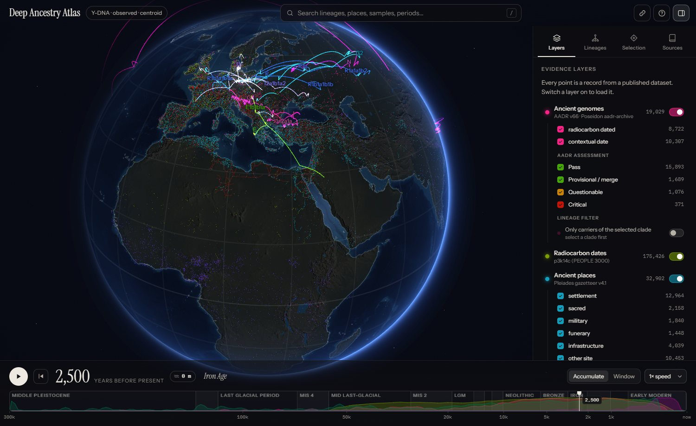

---

## The premise

**You cannot download migration paths.** They are not a dataset. What exists is points in
space-time — dated, georeferenced ancient genomes — and a tree of which lineage split from which.
A path is what you get by inferring the missing middle, and every migration map you have ever
seen is that inference, drawn by hand, with the uncertainty left off.

So this tool is built to keep the inference visible as an inference. It will not draw you a
confident arrow it cannot support, and where it has to guess it tells you how much of the answer
is coming from the guess.

## Using the atlas

- **Search** (`/`) finds lineages on both markers, places, samples and named periods; pick one and
  the globe flies to it.
- **The strata timeline** along the bottom is the main control. Named periods are drawn as bands,
  and the sediment inside them is the density of dated records for every layer that is on — so the
  sampling bias stays in view the whole time. Drag it, press `space` to play, `←` `→` to step.
- **The panel** has four tabs. *Layers* switches evidence on and off, with per-class filters, the
  AADR quality grades and the date range. *Lineages* picks the marker, the tree source, the
  placement estimator and the detail cut. *Selection* is the dossier for whatever you clicked: a
  clade's route from the root, a record's citation, and every loaded layer within a radius,
  exportable as CSV. *Sources* carries the licences and the coverage chart.
- **Click** anything on the globe to inspect it; hover to identify it. `Esc` clears the selection,
  `L` hides the panel, `?` opens the guide.
- **The URL is the view.** Marker, tree, placement, selection, time, camera and layers all live in
  the hash, so a link reproduces exactly what you were looking at. The link button copies it.

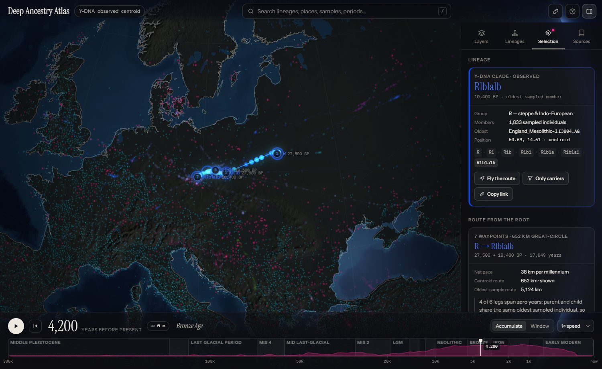

## Layers

| Layer | Records | Source | Licence |
|---|---:|---|---|
| Ancient genomes | 19,029 | AADR v66 via Poseidon | cite the release DOI ×2 |
| Radiocarbon dates | 175,426 | p3k14c (PEOPLE 3000) | MIT code · tDAR data |
| Ancient places | 32,902 | Pleiades gazetteer v4.1 | CC BY 3.0 |
| Roads & routes | 3,840 polylines | AWMC / Barrington Atlas | **ODbL 1.0 — share-alike** |
| Languages | 26,696 | Glottolog CLDF | CC BY 4.0 |
| Documented societies | 1,291 | D-PLACE Ethnographic Atlas | CC BY 4.0 |
| Ancient metagenomes | 3,241 | AncientMetagenomeDir | CC BY 4.0 |
| Land outlines | 48,000 points | Natural Earth 110m | public domain |

The ground the records sit on has sources too:

| Ground | Size | Source | Licence |
|---|---:|---|---|
| Terrain & sea floor | 4096 × 2048 raster | ETOPO 2022, 60 arc-second (NOAA NCEI) | not copyrighted in the US · cite |
| Sea level | 301 values, 0 to 300 ka | Spratt & Lisiecki 2016 | cite the paper (CC BY 3.0) |
| Ice sheets | 33 slices, 80 ka to present | PaleoMIST 1.0 (Gowan et al. 2021) | CC BY 4.0 |
| Coastline, lakes, land mask | 113,423 vertices | Natural Earth 10m | public domain |

Read [`ATTRIBUTION.md`](ATTRIBUTION.md) before redistributing any built data. The route layer is
share-alike and MIT on the code does not launder that.

## The ground

The globe under the data is the real Earth, drawn dark. Land and sea floor come from ETOPO 2022.
Relief is shaded from the slope of the terrain, by the same sun that lights the sphere, and the
tints are kept so low that the median of lit land sits at a luminance of about 0.012, with its
brightest tenth near 0.02. Those figures are a budget, measured on rendered pixels. The data
palette was validated against a near-black globe, and on this ground its darkest colours still
keep 91 to 94% of the contrast they had there (84 to 88% over the brightest tenth). A brighter
Earth looked better and cost the purples and blues their legibility, so height is carried by
shadow and hardly at all by colour.

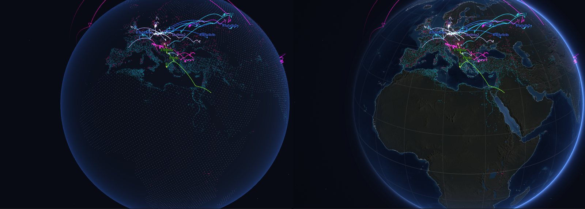

**The coastline follows the timeline.** Sea level comes from the Spratt & Lisiecki (2016) stack,
and the shader cuts today's sea floor at that level. Scrub to 21,000 BP and the sea drops 120 m:
Beringia, Sundaland, Sahul and Doggerland come up out of the water. Ground that is dry at that
date but sea floor today gets a paler, cooler tint, so paleo-land is never mistaken for land that
was always there. The chip beside the year gives the level, and its tooltip the uncertainty.
Today's coastline stays on top as thin linework.

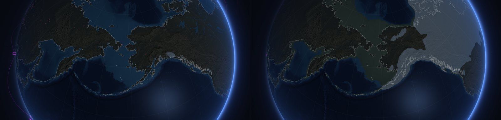
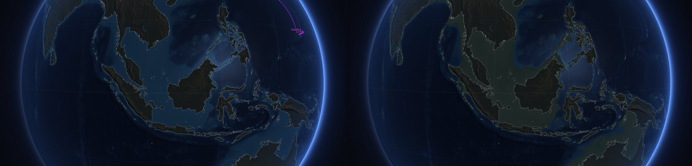
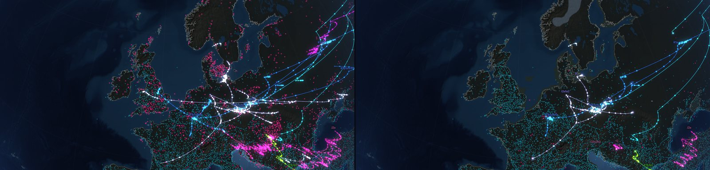

**Ice moves with it.** Margins are PaleoMIST 1.0, one slice every 2,500 years back to 80,000 BP,
stored as signed distance fields so that the ice edge travels between slices. A plain crossfade
would fade one outline out while the next faded in. PaleoMIST has nothing before 80,000 BP, and
the interface says so: the ice drawn there is an analogue, the slice from the last glacial cycle
whose sea level matches.

None of this is a palaeogeographic reconstruction. It is present-day topography with the sea
lowered. It leaves out the rebound of land that the ice had pressed down, as well as tectonics and
ten thousand years of river sediment. So it is sound far from the old ice sheets (Sunda, Sahul,
Beringia) and a sketch close to them (Hudson Bay, the Baltic). The stack puts the last
interglacial sea 3 m above today's, which is below the raster's resolution and is not drawn.
Lakes are today's at every date.

## The camera

**Fly the route** runs the camera along a spline through the waypoints: one cubic Bézier per leg,
evaluated with nested slerps so that it stays on the sphere. Where a leg's tangent lines up with
the great circle, the curve is exactly the arc's own path, so the growing tip sits under the
camera. Where the route turns, the corner is rounded. The camera climbs on long legs and settles
over each arrival, and the clock runs in step with it. A comet head marks the tip, and each
waypoint gets a ring on the ground as the route reaches it. [`docs/fly-route.mp4`](docs/fly-route.mp4)
is twenty seconds of it: Y-DNA Q1b1a3, 16,553 km from a root beside the Laurentide ice.

Press play with a lineage selected and the camera follows the growing tip. It eases its speed
under an acceleration cap, so a chase that starts far from the tip still starts from rest. Any
drag, wheel or pinch hands the camera back at once. With reduced motion set, flights become cuts
and nothing moves by itself.

Left alone for six seconds and seen from far enough out, the globe leans onto its 23.4° axis and
turns about it. Touch it and it rights itself, north up, within about a second.

| Extra | Off, then on |
|---|---|
| Bloom: bright marks pulled out at quarter size, blurred, added back | 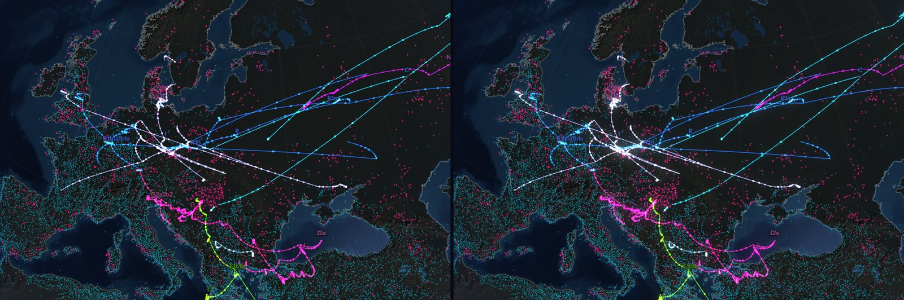 |
| Anti-aliasing kept through the post pass: 4× multisampling, FXAA where that is off | 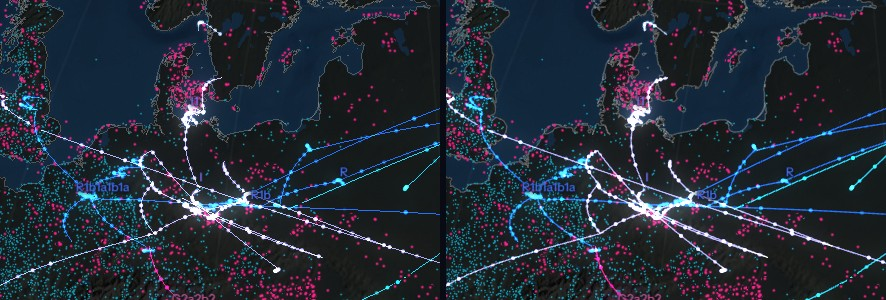 |
| A soft spotlight over the selected route | 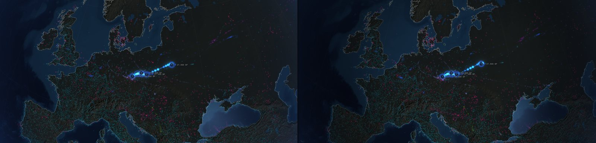 |
| Graticule and the idle axial tilt | 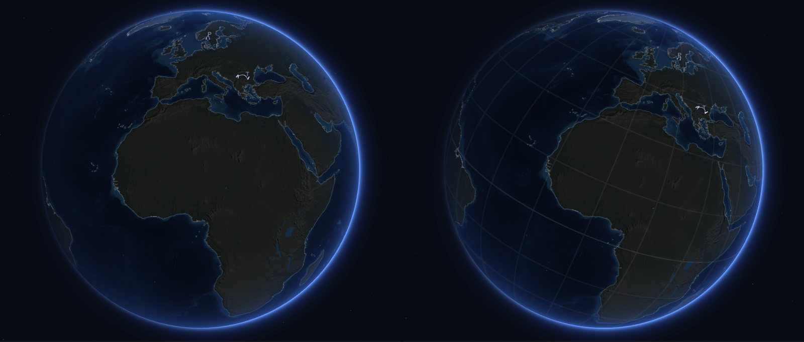 |
| The rasters stream in after the evidence; the dotted globe draws until they arrive | 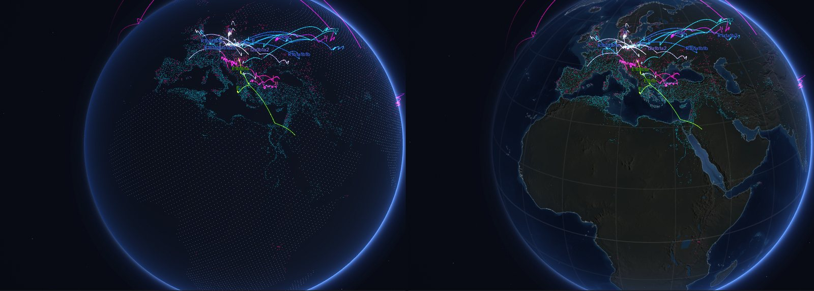 |

Each image is one frame with a single switch flipped: off on the left, on on the right. The
switches are the `FX` object and `QUAL`, reachable from the console.

The page times its own GPU cost per frame, where the browser exposes a timer query, and steps
quality down if a frame costs more than 11 ms: multisampling goes first, then bloom and
resolution. `#q=0` to `#q=3` in the URL pins a level and switches that off.

## The tree is computed, not typed in

Haplogroup nomenclature **is** the topology — `R1b1a1` nests inside `R1b1` inside `R1b` — so the
tree is built by prefix-parsing the AADR's own Y and mtDNA calls across 19,029 dated individuals.
701 Y clades and 705 mtDNA clades fall out.

Two constraints are baked into the result and stated in the interface:

- **A node's date is its oldest observed member, not a TMRCA.** A clade is always older than the
  oldest person we happened to dig up carrying it. Because membership is nested, a parent's
  oldest member is automatically at least as old as any child's, so branches run forward in time
  without needing an assumption.
- **A node's position is a summary of where its carriers were excavated**, which is not where the
  clade arose. Both estimators ship — spherical centroid, and the location of the single oldest
  member — because they disagree, and the disagreement is the point.

A **reference backbone** mode carries the hand-entered published tree instead, for the deep
structure the sampled record cannot reach. It is labelled as not-observed.

## Tracing a lineage

Select a clade and the **route** card lays out its path from the root: numbered waypoints on the
globe, every hop with position, leg distance, elapsed time, implied pace and member count,
exportable as CSV. **Fly the route** walks the camera through the waypoints while the clock
advances with it.

The card is built to argue with itself:

- It reports path length under **both** estimators and flags disagreement past 1.6×. Y-DNA
  `N1a1a1a1a` is 1,757 km by centroid and 10,063 km by oldest sample — a 5.7× gap that is route
  supplied by the choice of statistic rather than by data.
- It flags legs spanning **zero years**, where parent and child share one oldest sampled
  individual and the leg therefore dates nothing.
- It **refuses an implausible pace**. `Q1b1a1a` on the oldest-sample estimator implies 11,508 km
  per millennium. The card says plainly that this is not a rate of travel: Q's oldest sampled
  carrier is Anzick-1, in Montana, so the waypoints are not in ancestral order at all. A parent
  clade's oldest carrier can sit deep inside a descendant population.

## Filters

- **Only carriers of the selected clade** — matches each individual's own haplogroup call against
  the clade tree, collapsing the evidence layer to exactly the people carrying that lineage
  (`R1b1a1b1a1a2`: 19,029 genomes → 725). Matching walks the tokenised haplogroup path rather
  than string prefixes, because mtDNA **H11 is a sibling of H1, not its descendant** — a
  `startsWith` would silently produce wrong carrier sets.
- **Date range** — a hard filter in years BP; the scrubber then animates inside it.
- **Genome quality** — the AADR's own assessment grades.
- **Per-layer class filters**, and a **search** that reaches below the detail cut.

## The cross-layer query

The thing no existing tool does. Pick a clade or a record, set a radius, and every loaded layer
answers at once — 11,595 records across six datasets within 500 km of `R1b1a1`. Export is CSV
carrying layer, source, licence, coordinates, date, uncertainty, distance and a **resolvable
reference per row**. If you cannot cite it, it is not a research tool.

## What the data says, whether or not you wanted to know

- **99.3% of ancient genomes are younger than 15,000 BP** (radiocarbon: 95.8%). The deep-time
  story this project exists to tell rests on well under 1% of the evidence. The timeline draws it
  as sediment under every period and the Sources tab plots it per layer on a log scale, because
  it should condition every other view.
- **The observed Y tree is a forest, not a tree.** Its macro-haplogroups have no connections above
  them: the AADR's nomenclature does not encode the deep backbone and no sampled individual
  bridges it. The single-rooted textbook tree is an inference the sampled record does not contain.
- **Pleiades lights up the Mediterranean and nothing else.** That is where classicists worked, not
  where people lived.

## Build it

```sh
cd build
./fetch-sources.sh          # every upstream source; all public, no keys
pip install pyreadr rasterio numpy pillow scipy
python3 build-tree.py       # AADR haplogroup calls -> clade trees
python3 build-haplink.py    # genome -> clade index, for lineage filtering
python3 build-layers.py     # everything else -> out/
python3 build-ice.py        # PaleoMIST margins -> ice atlas
python3 build-earth.py      # ETOPO, Natural Earth, sea level -> terrain, relief, coastline
cd .. && mkdir -p d && cp build/out/* d/
python3 -m http.server 8000
```

The ground is the heavy part of the fetch: ETOPO is a 466 MB GeoTIFF. PaleoMIST is a 3.5 GB
archive, but `remotezip.py` reads only its ice margins, about 45 MB, over HTTP range requests.
`build-earth.py` takes six minutes, most of it a median over 233 million cells, and ends by
checking eighteen named sites (Beringia, Sundaland, Doggerland, the Nile delta, a Dutch polder)
against the raw grid. It exits non-zero if any of them comes out on the wrong side of the water.
`--cached` re-encodes from its last run without the long pass.

`index.html` fetches from a sibling `d/`, so it needs a server, not `file://`. Any static host
works; there is no build step and nothing to install for the page itself.

## Formats

Point layers are 15-byte records — `int32` lat and lon at 1e-5°, `int32` years BP, `uint16`
uncertainty, `uint8` class and flags — base64'd into `.txt`, because artifact hosting serves no
binary media type. Metadata rides in tab-separated sidecars loaded lazily, only when a record is
inspected or a query is exported. Geography is a 48,000-point Fibonacci-sphere bitmask: 8 KB for
the whole world, uniform density, no polar bunching.

The terrain is two images per size (4096 px, and 2048 px for phones). `earth-N.webp` is lossless:
its red channel is mean elevation, square-root companded for tinting, and its green channel is
the *median* elevation in 1 m steps from -150 m to +105 m, which is what the coastline is cut
from. The median matters. A texel is land at sea level S exactly when more than half of its cells
stand above S, and the median is the one number for which that holds at every S. A mean lets a
few deep cells drag a texel of +1 m polder or coastal plain under water, which is where people
lived. Land that is dry today but lies below sea level is lifted to +1 m using the Natural Earth
land mask, since nothing connects it to the ocean. `relief-N.webp` is lossy and holds the slope
gradient, east stacked over north, so that relief can be lit by the real sun and is not baked
under a fixed one. `ice.png` is an atlas of 33 signed-distance tiles. The coastline reuses the
routes format.

Categorical colour was computed rather than chosen. Both palettes — eight lineage groups and
seven layers — were validated for colour-vision deficiency at all-pairs separation against the
near-black surface (lineages: worst CVD ΔE 9.4 against an 8.0 target; layers: 10.0). That is why
they are not the obvious hues.

## Known gaps

Three datasets would materially improve this and are not in it, because they were unreachable from
the sandbox this was built in: the **28,347-value bioavailable strontium compilation**
(individual-scale mobility, the genuinely novel view nobody has built), **Neotoma**
(palaeoecology), and **ROAD** (deep-time archaeology — the most damaging gap, since Pleiades
starts around 1200 BCE and the migration story is largely over by then).

The ground has gaps of its own:

- **The coastline is eustatic.** It is today's sea floor cut at a global mean sea level. PaleoMIST
  ships rebound-corrected palaeotopography for the same 33 slices, at a quarter of a degree, and
  that would be the better coast near the old ice sheets.
- **Ice before 80,000 BP is an analogue**, not a reconstruction. Batchelor et al. 2019 covers
  those cycles, but its shapefiles carry no licence (see `ATTRIBUTION.md`). PaleoMIST also leaves
  out mountain glaciation beyond its four ice sheets, so the Alps and Tibet are bare at the Last
  Glacial Maximum.
- **The sky is procedural.** The Bright Star Catalogue was the plan, and its terms could not be
  verified.
- **A density mode for the 175,000 radiocarbon dates** was on the list and is not built. Darkening
  the ground took care of the legibility problem it was partly meant to solve.
- **Performance on an integrated GPU is not measured.** The machine this was built on has none. On
  an RTX 3080 at 2560 × 1440 with all 262,000 points on, a full-quality frame costs the GPU about
  3.8 ms, against 2.6 ms for the dotted globe it replaces. The frame-time governor is there for
  the hardware that could not be tested.

The honest next step for the science is to replace both position estimators with a Brownian-bridge
ancestral-state reconstruction. Centroid compresses routes toward zero, oldest-sample is hostage
to a single skeleton, and neither is defensible as *the* answer. The fix is a posterior rather
than a point — which is also what would let the globe render uncertainty as a cloud instead of a
line.
